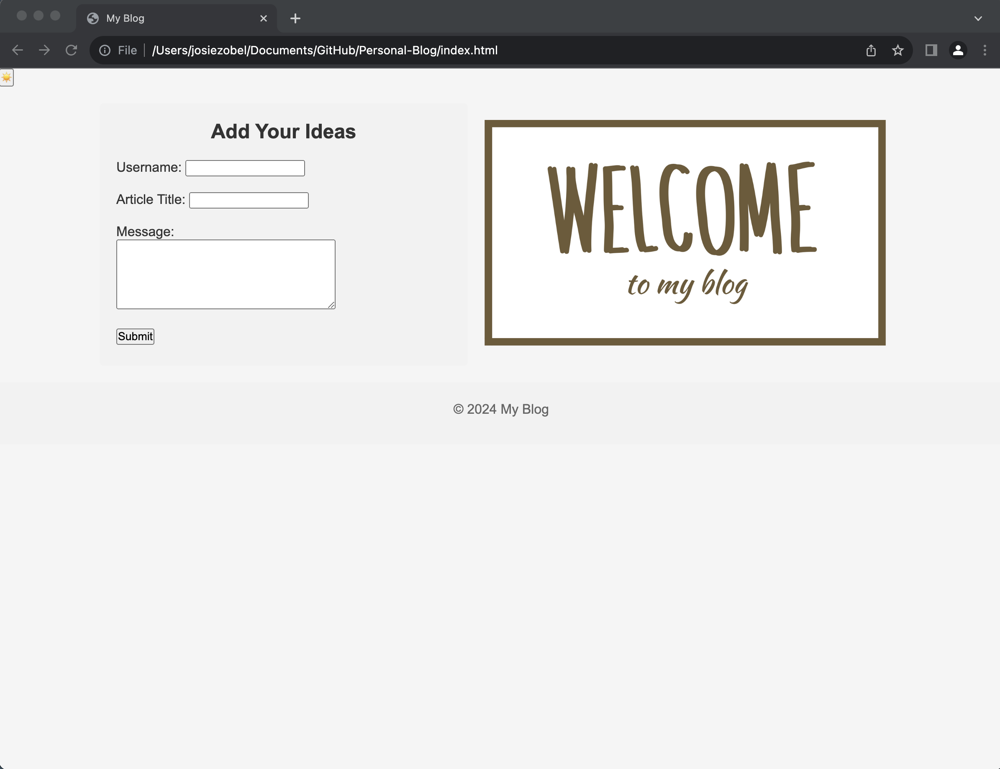
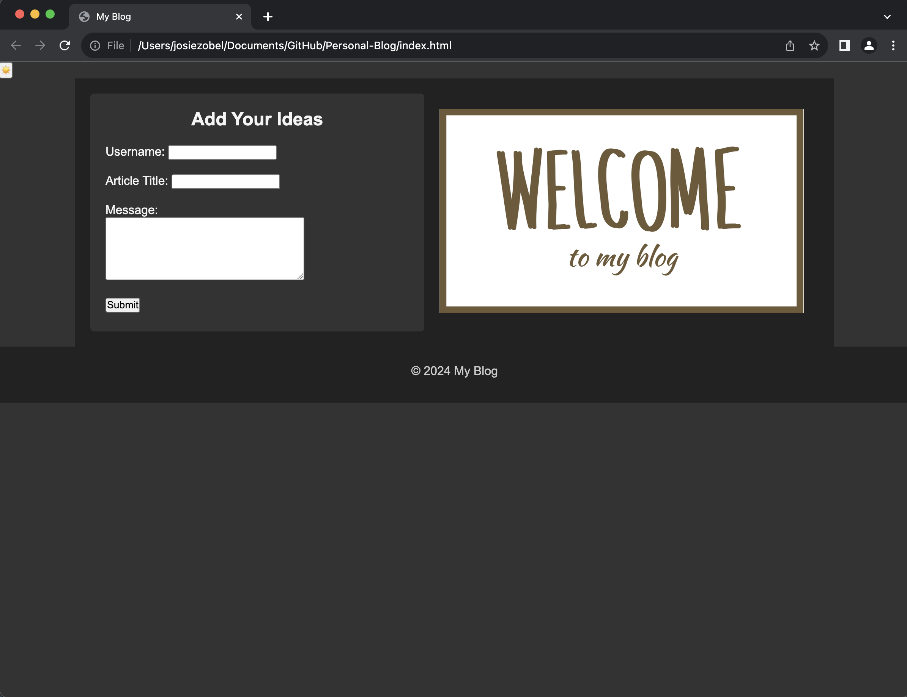
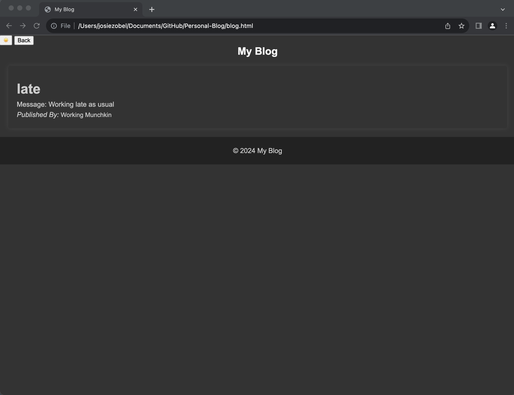

# Personal Blog

## User Story

AS A marketing student

I WANT a personal blog

SO THAT I can showcase my thoughts and experiences

## Acceptance Criteria

* It is done when the app loads and the user is presented with a landing page containing a dorm with labels and inputs for username, blog title and blog content

* It is done once the form is submitted and the data is stored in the localStorage

* It is done when the user is redirected to the posts page once the form is submitted 

* It is done when if no content is entered the user is presented with a message that prompts them to complete the form

* It is done when the posts page is displayed and the user is presented with a header, a light mode/dark mode toggle, and a "Back" button

* It is done when the user clicks the light mode/dark mode toggle and the pages contents reflect the selection

* It is done when the user clicks the "Back" button and they are redirected to the landing page where more blog entires can be input

* It is done when the user views the main content and is presented with a list of blog posts that are pulled into the localStorage

* It is done when the user views the localStorage and is presented with a JSON array of blog post objects, each including the username, blog title, and contents

* It is done when the user takes a closer look at a single blog entry in the list and can see the title, the content and the author of the post

* It is done when the user views the footer and is presented with a link to the developers portfolio

## Description
  The website allows the user to put in their username, title of their blog as well as the message they want to include. Once the user submits the form they will be directed to the blog site and be able to see the post they submitted as well as any other posts that were made to the localStorage. 

  There is a button in the top left corner that allows the user to change between light and dark mode. The modes will adjust all backgrounds and container properties to match the mode that was selected. The button is programmed to be a double click therefore the user has to doubleclick the sun to be able to change the screen mode.

## Images
Starting Page

Dark Mode Starting Page

Blog Page 

